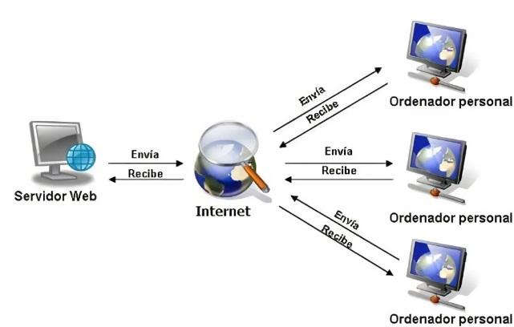

# 0373-A2-ChristianCobanoGarcia

## Evaluación Inicial
### ¿Qué es una página web?
- Una página web es una ventana en donde podemos interactuar de la cual solo vemos visible el **FrontEnd**.
### ¿Qué es un servidor web?
- El servidor web es el sitio donde se hospeda la información de dicha pagina web.
### ¿Qué son los lenguajes de marcas? ¿Cúantos conoces?
| HTML | XML |
|---------|---------|
|MARKDOWN|CSS|

### ¿Qué és HTML? ¿Sabes cómo se estructura?
- Es el código que se utiliza para estructurar y desplegar una página web y sus contenidos.
```html
<!DOCTYPE html>
<html lang="en">
<head>
    <meta charset="UTF-8">
    <meta http-equiv="X-UA-Compatible" content="IE=edge">
    <meta name="viewport" content="width=device-width, initial-scale=1.0">
    <title>Document</title>
</head>
<body>

</body>
</html>
```
*Figura 1 :  Estructura de código HMTL*

### ¿Qué es **_CSS_**?
- Lenguaje que maneja el diseño y presentación de las páginas web, es decir, cómo lucen cuando un usuario las visita.

### ¿Sabes cómo funciona un navegador web?
- Un navegador web interpreta y permite a los usuarios interactuar con la página web, usualmente divido en dos partes:
    - **FrontEnd** : Parte visual o gráfica que ve el usuario final que navega por la página web.
    - **BackEnd** : Parte operada por un técnico que se encarga de configurar y personalizar el código para su resutado final hacía el usuario final.
    - 


*Figura 2 : Esquema de peticiones HTML*